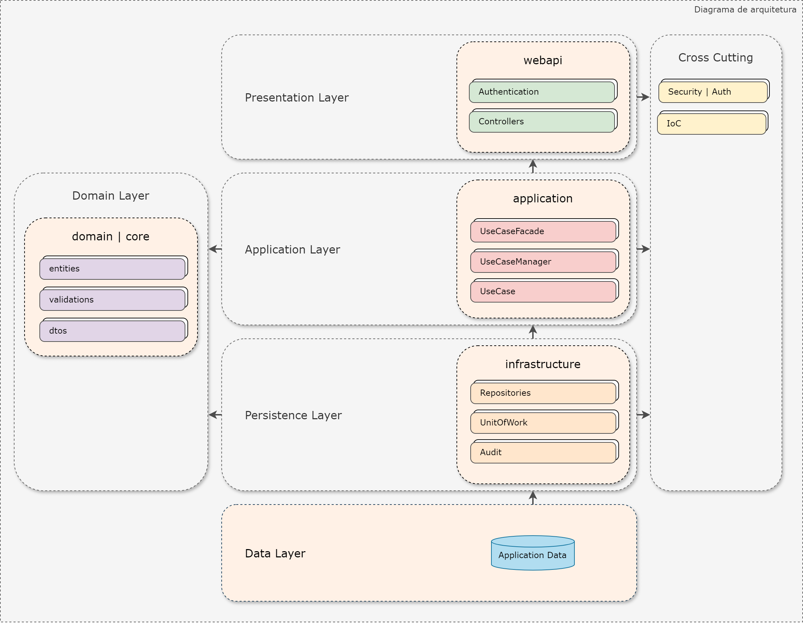

# Projeto com arquitetura limpa, utilizando use cases



Neste projeto, fui responsável pela arquitetura e desenvolvimento da estrutura central do código. Diante do desafio de um projeto extenso com mais de 70 tabelas e um prazo de desenvolvimento curto, optei pela Arquitetura Limpa (Clean Architecture) e pelo padrão Use Case. Para otimizar o processo, idealizei uma arquitetura que orientasse os desenvolvedores por meio de um fluxo estruturado na implementação de cada Casos de Uso.

Acredito que o principal ganho deste projeto foi a velocidade de desenvolvimento, impulsionada pela arquitetura e pela redução significativa do retrabalho, resultado da adoção do padrão Use Case. Este padrão exige a implementação de cada caso de uso em uma classe com um único método público, o que minimizou a necessidade de revisões, exceto em casos de alterações nas regras de negócio, que foram infrequentes.

O código apresentado aqui é um recorte do projeto completo, focado em demonstrar a arquitetura geral.

A seguir, apresentarei a estrutura do código, detalhando cada camada:

## Camada web-api

Os `Controllers` relacionados às entidades de negócio (`ProcessoOfertaNegociacaoController`) foram projetados para conter apenas a implementação da lógica de negócio, abstraindo ao máximo os detalhes técnicos em classes base, como `AppBaseController` e `GenericBaseController`.

Nesse contexto, a classe `UseCaseFacade` desempenha um papel central na abstração da complexidade técnica. Ela utiliza o padrão Facade para "ocultar" a lógica de resolução das dependências necessárias para cada Caso de Uso. Detalharei essa classe na seção da camada `application`.

A seguir, apresento a implementação simplificada das operações CRUD (Criar, Ler, Atualizar e Deletar) para a entidade `ProcessoOfertaNegociacao`, por meio do seu respectivo controller:

```c#
[HttpGet]
public async Task<IActionResult> Listar(DataSourceLoadOptions options)
{
    return await List<ProcessoOfertaNegociacaoDto>(options);
}

[HttpPut]
public async Task<IActionResult> Editar([FromBody] ProcessoOfertaNegociacaoEditarDto dto)
{
    return await Update<IProcessoOfertaNegociacaoEditarUseCase, ProcessoOfertaNegociacaoEditarDto>(dto);
}

[HttpPost]
public async Task<IActionResult> Incluir([FromBody] ProcessoOfertaNegociacaoIncluirDto dto)
{
    return await Insert<IProcessoOfertaNegociacaoIncluirUseCase, ProcessoOfertaNegociacaoIncluirDto>(dto);
}

[HttpDelete]
public async Task<IActionResult> Excluir([FromQuery] ProcessoOfertaNegociacaoExcluirDto dto)
{
    return await Remove<IProcessoOfertaNegociacaoExcluirUseCase, ProcessoOfertaNegociacaoExcluirDto>(dto);
}

[HttpGet]
public async Task<IActionResult> Obter([FromQuery] ProcessoOfertaNegociacaoListarDto dto)
{
    return await Get(dto);
}
```

Em situações onde os casos de uso não se enquadravam nas operações CRUD convencionais, o UseCaseFacade permitia a implementação de funcionalidades especializadas, ilustradas no seguinte exemplo:

```c#
[HttpPost]
public async Task<IActionResult> CalcularValorOferta([FromBody] CalculoValorOfertaDto dto)
{
    var result = await Facade.ExecuteAsync<ICalcularValorOfertaUseCase, CalculoValorOfertaDto>(dto);

    if (result.Sucesso)
    {
        return Ok(result);
    }

    return CreateErrorResponse(result);
}
[HttpPost]
public async Task<IActionResult> IniciarNegociacao([FromBody] ProcessoOfertaIniciarNegociacaoDto dto)
{
    var result = await Facade.ExecuteAuditableAsync<IProcessoOfertaIniciarNegociacaoUseCase, ProcessoOfertaIniciarNegociacaoDto, ListaOfertasRankingDto>(dto, LoggedUser);

    if (result.Sucesso)
    {
        return Ok(result);
    }

    return CreateErrorResponse(result);
}
[HttpPost]
public async Task<IActionResult> PermiteInicioNegociacao([FromBody] ListaOfertasRankingDto dto)
{
    var result = await Facade.ExecuteAsync<IProcessoOfertaValidaInicioNegociacaoUseCase, ListaOfertasRankingDto>(dto);

    return Ok(result);

}
```

## Camada application

No desenvolvimento de aplicações, é crucial fornecer feedback claro sobre o resultado de cada ação ou caso de uso, seja ele de sucesso ou falha. Nesse contexto, surge a decisão entre o uso de `Exceptions` para sinalizar erros e validações inesperadas, ou a adoção do padrão Result. Neste projeto, optei pelo padrão Result, pois acredito que ele ofereça maior controle sobre as informações retornadas ao usuário final. Além disso, diversos estudos apontam para o impacto negativo na performance causado pelo uso excessivo de `Exceptions`. No entanto, a implementação do padrão Result exige o tratamento explícito de cenários de sucesso e erro.

Na pasta `use-cases`, reside a lógica de orquestração do sistema. Conforme mencionado anteriormente, a classe `UseCaseFacade` abstrai a resolução de dependências para cada caso de uso, utilizando a classe `UseCaseManager` para gerenciar o container de dependências. Para essa gestão, empregamos a biblioteca `Autofac`, que oferece recursos robustos para a injeção precisa de dependências em cenários complexos.

A seguir, apresento um exemplo de chamada ao facade:

```c#
public async Task<ISingleResultDto<TDtoReturn>> ExecuteAuditableAsync<TUseCase, TDto, TDtoReturn>(TDto dto, User user)
        where TUseCase : IAuditableUseCase<TDto, TDtoReturn>
        where TDto : AuditableEntityDto
        where TDtoReturn : EntityDto
{
    try
    {
        var useCase = manager.ResolveAuditableUseCase<TUseCase, TDto, TDtoReturn>(dto, user);
        manager.Prepare(useCase, dto, user);

        return await useCase.ExecuteAsync();
    }
    catch (TimeoutException ex)
    {
        logger.LogError((ex.InnerException != null) ? ex.InnerException.ToString() : ex.ToString());

        return new SingleResultDto<TDtoReturn>(ex);
    }
    catch (Exception ex)
    {
        logger.LogError((ex.InnerException != null) ? ex.InnerException.ToString() : ex.ToString());

        return new SingleResultDto<TDtoReturn>(ex);
    }
}
```

A seguir, apresento um exemplo de resolução de dependências:

```c#
public IAuditableUseCase<TDto, TDtoReturn> ResolveAuditableUseCase<TUseCase, TDto, TDtoReturn>(TDto dto, User user)
    where TUseCase : IAuditableUseCase<TDto, TDtoReturn>
    where TDto : AuditableEntityDto
    where TDtoReturn : EntityDto
{
    return container.Resolve<TUseCase>(new TypedParameter(typeof(TDto), dto), new TypedParameter(typeof(User), user));
}
```

Em um cenário de execução se eu tinha um caso de uso `ProcessoOfertaNegociacaoIncluirUseCase` conforme a classe abaixo:

```c#
public class ProcessoOfertaNegociacaoIncluirUseCase : AuditableUseCase<ProcessoOfertaNegociacaoIncluirDto>, IProcessoOfertaNegociacaoIncluirUseCase
{        
    private readonly IProcessoOfertaRepository _ofertaRepository;        
    private readonly IProcessoOfertaNegociacaoIncluirValidation _validation;
    private readonly IUseCaseManager _manager;

    public ProcessoOfertaNegociacaoIncluirUseCase(ProcessoOfertaNegociacaoIncluirDto dto, IProcessoOfertaRepository ofertaRepository, 
        IProcessoOfertaNegociacaoIncluirValidation validation, IUseCaseManager manager, 
        IMapper mapper, IAuditContext auditContext, User user, IUnitOfWork uow) 
        : base(dto, user, auditContext, mapper, uow)
    {
        _ofertaRepository = ofertaRepository;            
        _validation = validation;
        _manager = manager;
    }
}
```

A linha de código `container.Resolve<TUseCase>(new TypedParameter(typeof(TDto), dto), new TypedParameter(typeof(User), user))` localiza o caso de uso, injeta os parâmetros `dto` e `user` em seu construtor e resolve automaticamente as demais dependências necessárias para a instanciação da classe, utilizando o `Autofac`.

Um requisito importante do projeto era a auditoria de todas as operações realizadas nas entidades de negócio. Para isso, implementamos a classe base `AuditableUseCase`.

Nesta camada, também realizamos validações de interface, garantindo que os dados recebidos estejam em conformidade com os padrões esperados. Por exemplo, validamos se um campo numérico é maior que zero ou se um campo de texto não excede 255 caracteres.

Por fim, a classe `ApplicationModule` registra as dependências desta camada por meio da função `RegisterGeneric`. No exemplo abaixo, todas as classes que herdam de `UseCase<T>` são registradas automaticamente, simplificando significativamente o processo.


```c#
builder.RegisterGeneric(typeof(IncluirUseCase<,>))
            .As(typeof(IIncluirUseCase<,>))
            .InstancePerDependency();
```

## Camada Core

Esta camada contém as classes que implementam as regras de negócio da aplicação, incluindo as validações de negócio.

Veja abaixo uma classe que implementa uma validação:

```c#
public class ProcessoOfertaNegociacaoIncluirValidation : EntityValidation<ProcessoOfertaNegociacao, ProcessoOfertaNegociacaoIncluirDto>, IProcessoOfertaNegociacaoIncluirValidation
{
    private readonly IProcessoOfertaRepository repositoryOferta;
    public ProcessoOfertaNegociacaoIncluirValidation(IProcessoOfertaRepository repositoryOferta,
        IRepository<ProcessoOfertaNegociacao> repository)
        : base(repository)
    {
        this.repositoryOferta = repositoryOferta;
    }

    public override async Task<ISingleResult<ProcessoOfertaNegociacao>> ValidarAsync(ProcessoOfertaNegociacao entity)
    {
        var oferta = await repositoryOferta.GetOfertaNegociacaoAsync(entity.IdProcessoOferta);

        var possuiOferta = await repositoryOferta.PossuiOfertaPorAberturaAsync(oferta.IdProcessoAbertura);
        if (possuiOferta)
        {
            return new SingleResult<ProcessoOfertaNegociacao>(MensagensNegocio.MSG41);
        }

        return await Task.Run(() => new SingleResult<ProcessoOfertaNegociacao>());
    }
}
```

## Camada Domain

Aqui, encontramos as classes que representam as entidades de negócio, bem como os DTOs (Data Transfer Objects) que definem a estrutura dos dados retornados para a interface do usuário.

Veja abaixo uma classe DTO, que deve ser auditada e o atributo `AuditableEntity` decorando a classe:

```c#
[AuditableEntity(Acao = Enums.EnumAcao.Inclusao, Funcionalidade = Enums.EnumFuncionalidade.ProcessoNegociacao, Secao = Enums.EnumSecao.Oferta)]
public class ProcessoOfertaNegociacaoDto : AuditableEntityDto
{
    public long NumeroRodada { get; set; }
    public string OrigemOferta { get; set; }
    public decimal? ValorTaxaFrete { get; set; }
    public decimal? ValorTaxaSobreEstadia { get; set; }
    public decimal? QuantidadeTempoLaytime { get; set; }
    public decimal? QuantidadeLote { get; set; }
    public decimal? ValorFinal { get; set; }
    public decimal? ValorDolarTonelada { get; set; }
    public bool IndicadorAtivo { get; set; }
    public decimal? QuantidadeVazaoCarga { get; set; }
    public decimal? QuantidadeVazaoDescarga { get; set; }
    public long IdProcessoOferta { get; set; }
    public EnumUnidadeMedidaSobreEstadia? UnidadeMedidaSobreEstadia { get; set; }
    public EnumUnidadeMedidaFrete? UnidadeMedidaFrete { get; set; }
}
```

## Camada Infrastructure

Esta camada é responsável pelo acesso ao banco de dados. Adotei padrões consolidados como Repository e Unit of Work, que fornecem uma camada de abstração entre a aplicação e o acesso aos dados, além de isolar a tecnologia do banco de dados. Curiosamente, iniciamos o desenvolvimento com SQL Server, mas o cliente solicitou a migração para Oracle. Graças à abstração proporcionada pelos padrões adotados, a transição foi realizada com mínimo retrabalho.

Nesta camada, também implementamos a lógica para registrar e armazenar os dados de auditoria de todas as operações realizadas nas entidades de negócio, centralizada na classe `ApplicationDbContext`.

Veja um trecho de código dessa classe:

```c#
private Task OnAfterSaveChanges(Guid codigoTransacao, List<AuditEntry> auditEntries)
{
    if (auditEntries == null || auditEntries.Count == 0)
        return Task.CompletedTask;

    foreach (var auditEntry in auditEntries)
    {
        // Get the final value of the temporary properties
        foreach (var property in auditEntry.TemporaryProperties)
        {
            string propertyName = auditEntry.GetDisplayName(property.Metadata.Name);
            var defaultProperty = auditEntry.GetDefaultProperty(property);

            if (property.Metadata.IsPrimaryKey())
            {
                SetPrimaryKey(auditEntry, property, defaultProperty, propertyName);
            }
            else
            {
                auditEntry.NewValues[propertyName] = GetValue(property, property.CurrentValue, defaultProperty.CurrentValue);
            }
        }

        // Save the Audit entry
        LogAcoes.Add(auditEntry.ToLogAcao(codigoTransacao));
    }

    return SaveChangesAsync();
}
```

## Camada Cross-Cutting

Como o nome sugere, esta camada abrange todas as demais camadas, fornecendo funcionalidades transversais. Nela, encontramos as classes responsáveis pela implementação de IoC (Inversion of Control) e DI (Dependency Injection), bem como aspectos relacionados à segurança.

Abaixo a classe de Setup inicial do Autofac:

```c#
public static class ContainerSetup
{
    public static void AutofacInitialization(ContainerBuilder builder, bool isProduction)
    {
        var context = new AssemblyLoadContext("IoC");
                    
        var applicationAssembly = context.LoadFromAssemblyName(new AssemblyName("application"));
        var domainAssembly = context.LoadFromAssemblyName(new AssemblyName("domain"));
        var coreAssembly = context.LoadFromAssemblyName(new AssemblyName("core"));
        var infrastructureAssembly = context.LoadFromAssemblyName(new AssemblyName("infrastructure"));            
        var crossCuttingAssembly = Assembly.GetExecutingAssembly();

        builder.RegisterAssemblyTypes(domainAssembly, applicationAssembly, coreAssembly, infrastructureAssembly, crossCuttingAssembly).AsImplementedInterfaces();

        builder.RegisterAssemblyModules(coreAssembly, applicationAssembly, infrastructureAssembly);

        builder.RegisterModule(new CrossCuttingModule() { 
            IsProduction = isProduction
        });
    }
}
```